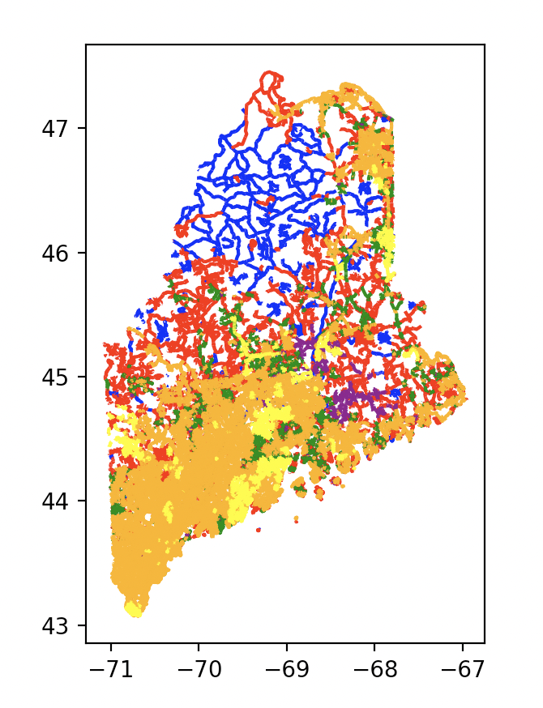
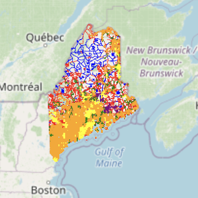
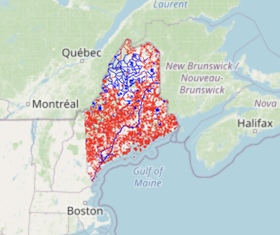
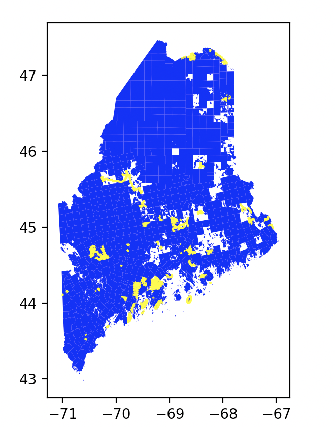
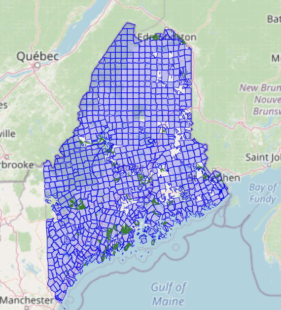
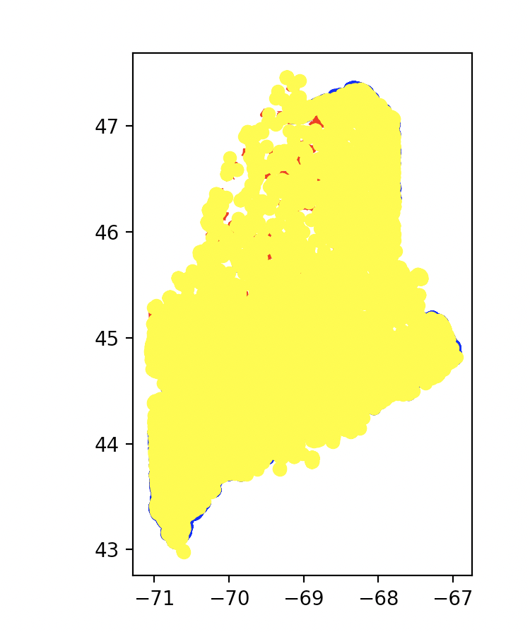
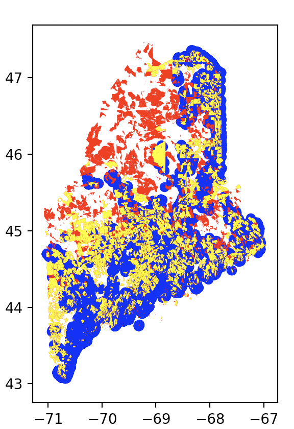
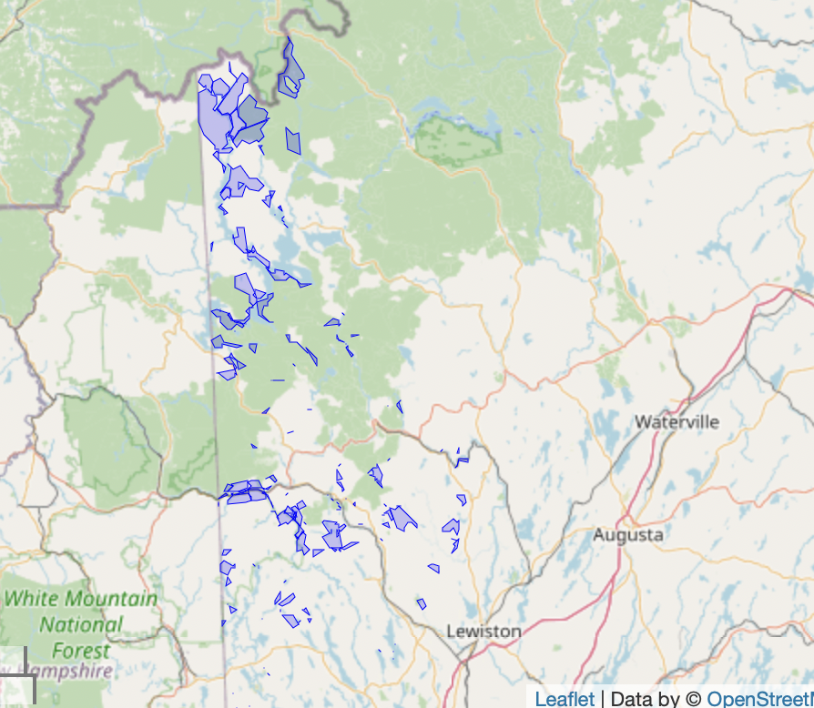
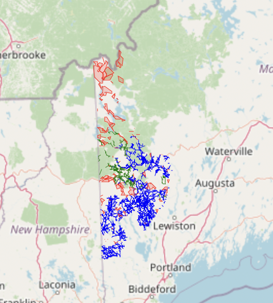

# assignment07_sophia

This repository is intended to capture the work I did for the broadband project as of April 6th 2022. For this assignment I wanted to try and visualize the layers in a way that made sense to me, as a starting point. I also wanted to test out folium and a protoype website.

# Explanation of the folders

The folder <code>/folium_test</code> simply contains a test of folium. It can be ignored for the purposes of this assingment.  

The folder <code>/folium_outputs</code> contains the HTML outputs of the functions that plot the data layers over a folium map. 

The folder <code>/docs</code> contains the test HTML website that uses the folium maps.

The folder <code>/img</code> contains screenshots of the outputs.

# Explanation of the python files
All of these files do roughly the same thing. They all contain code that:
1. Reads in json data
2. Makes a geojson data frame
3. Plots the information, generating a simple matplotlib object
4. Plots the information, generating a folium map
The folium map also has a function that allows the user to turn off and on the layers.
I chose to break up the data files into 4 parts: Tier data (<code>broadband_tier.py</code>), grant data(<code>broadband_grant.py</code>), may be underserved data(<code>broadband_may_under.py</code>), and underserved data (<code>broadband_underserved.py</code>). I am not sure that this is the best approach, but I think it makes sense to visualize some of these layers together. 

#Running the code
From the command line:
```
python broadband_tier.py
```
The code will first generate a matplotlib object. Once you are done viewing it, please close it and the code will generate the folium HTML file.
The same steps can be done for: 
```
python broadband_grant.py
python broadband_may_under.py
python broadband_underserved.py
```
# Outputs:
Simple plots:
Tier 0-5





Grant





May be underserved



Underserved



# HTML test
To see the HTML test website, please navigate to the <code>/docs</code> folder and open the <code>index.html</code> file. A test website with 2 of the folium maps should open.

# Issues
There seems to be a problem with large json layers and folium. For the code <code>broadband_underserved.py</code> and <code>broadband_may_under.py</code>, the folium part is commented out becuase it doesn't quite work. It should work in the same way as the grant and tier code, but I suspect that the layers are just too large, therefore those were not included in the HTML site and the output screenshots. I also struggled to upload the <code>tier_map_all_layer.html</code> file because it is too large for github. It should still work locally. Finally, when it came to testing out the HTML site, using the <code>tier_map_all_layer.html</code> file made it very laggy, so I instead made a version with only 2 layers for the prototype.

# assignment08_sophia

For this assignment the goal was to subet the data by Maine county. The file <code>county_subsets.py</code> contains several functions that create simple matplotlib plots and folium plots by county. 

# Running the code
To generate the simple matplotlib plot with one layer:
```
simple_plot('Oxford',url_un1)
plt.show()
```
The user can change the first argument to any county and the second argument to any broadband data file (out of the 5 files I was assigned).

To generate the simple matplotlib plot with three layers:
```
layer_plot('Oxford',urlt4,urlt5,url_un1)
plt.show()
```
The user can change the first argument to any county and the second, third, and fourth argument to any broadband data file (out of the 5 files I was assigned).

To generate the folium plot with one layer:
```
single_folium_map('Oxford',url_un1)
```
The user can change the first argument to any county and the second, third, and fourth argument to any broadband data file (out of the 5 files I was assigned).

To generate the folum plot with three layers:
```
layer_folium_map('Oxford',urlt4,urlt5,url_un1)
```
The user can change the first argument to any county and the second, third, and fourth argument to any broadband data file (out of the 5 files I was assigned).

# Output
The HTML folium outputs are <code>single_map.html</code> and <code>layer_map.html</code> 

Single folium


Layer folium


